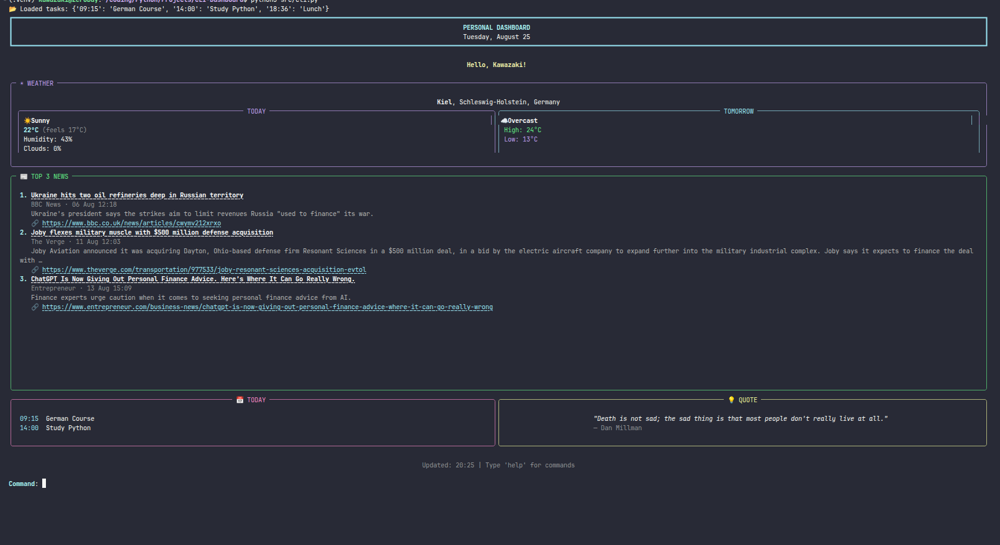

# 🌦️ Personal Dashboard CLI

A beautiful, interactive terminal dashboard that brings your daily essentials – **weather, top news, tasks, and a motivational quote** – right into your command line.

Built with **async HTTP** for speed, **caching** to avoid unnecessary API calls, and **Rich** for a polished terminal UI. It’s like having a personal assistant in your shell.

#### Preview
<p align="center">
  
</p>

---

## ✨ Features

- **Real‑time Weather** – Current conditions and tomorrow’s forecast (powered by [wttr.in](https://wttr.in)).
- **Top 3 News** – Latest headlines from NewsAPI (customizable query).
- **Today’s Tasks** – Manage your daily to‑do list with add/delete (persisted locally).
- **Daily Quote** – Get inspired by a random quote from [ZenQuotes](https://zenquotes.io).
- **⚡ Async & Cached** – All API calls run concurrently; results are cached to minimize latency and rate‑limit issues.
- **🗂️ Interactive Commands** – Refresh, add tasks, view details, or force a full update.
- **🛡️ Graceful Exit** – Press `Ctrl+C` anytime to see a friendly goodbye – no stack traces.

---

## 🚀 Getting Started

### Prerequisites

- Python 3.8+
- `pip` (or `pipenv` / `poetry`)

### Installation

1. **Clone the repository**

   ```bash
   git clone https://github.com/yourusername/dashboard-cli.git
   cd dashboard-cli
   ```

2. **Create a virtual environment** (recommended)

   ```bash
   python -m venv venv
   source venv/bin/activate   # Linux/macOS
   venv\Scripts\activate      # Windows
   ```

3. **Install dependencies**

   ```bash
   pip install -r requirements.txt
   ```

   If you don't have a `requirements.txt`, install manually:

   ```bash
   pip install rich toml httpx python-dotenv
   ```

### Configuration

1. **Create a `setting.toml`** in the parent directory of the dashboard folder (or adjust the path in the code).

   Example structure:

   ```toml
   [user]
   name = "Your Name"

   [weather]
   city = "London"
   country = "UK"
   ```

2. **Set your NewsAPI key** – create a `.env` file in the project root:

   ```env
   News_Api_Key=your_newsapi_key_here
   ```

   *(Get a free key at [NewsAPI](https://newsapi.org/register).)*

3. **No key required** for weather (wttr.in) or quotes (zenquotes.io) – they are free and public.

### Running the Dashboard

```bash
python src/cli.py
```

You’ll see the dashboard with data loaded from cache (if any) or fresh from the APIs.

---

## ⌨️ Interactive Commands

| Command          | Description |
|------------------|-------------|
| `w` / `weather`  | Display detailed weather information |
| `n` / `news`     | Show the top 3 news headlines |
| `cal` / `calendar`| View your today’s tasks |
| `add` / `a`      | Add a new task (you’ll be prompted for time and description) |
| `r` / `refresh`  | Refresh all data, respecting cache (only fetches expired items) |
| `f` / `force`    | Force a full refresh – bypass cache and fetch everything anew |
| `h` / `help`     | Show this command list |
| `q` / `exit`     | Quit the dashboard |

---

## 🧠 Caching

To speed up startup and reduce API calls, data is cached in `~/.dashboard_cache.json` with the following time‑to‑live (TTL):

| Data        | TTL   |
|-------------|-------|
| Weather     | 15 min |
| News        | 10 min |
| Quote       | 5 min  |

You can adjust these values in `cli.py` by changing the `CACHE_TTL` dictionary.

---

## 🗂️ Project Structure

```
.
├── cli.py                 # Main dashboard script
├── weather/
│   └── weather.py         # Async weather API client
├── news/
│   └── main.py            # Async news API client
├── tasks/
│   └── main.py            # Task manager (add/return tasks)
├── quotes/
│   └── main.py            # Async quote fetcher
├── setting.toml           # User settings (city, name, etc.)
├── .env                   # News API key (not committed)
└── requirements.txt       # Python dependencies
```

---

## 🛠️ Customization

- **Change the News query**: Edit the `q` parameter in `news/main.py` (default is `"finance"`).
- **Adjust cache TTL**: Modify the `CACHE_TTL` dictionary in `cli.py`.
- **Style**: All terminal styling is done with Rich – feel free to tweak colors and panels in the render functions.

---

## Acknowledgements

- [Rich](https://github.com/Textualize/rich) for making terminal UIs beautiful.
- [wttr.in](https://wttr.in) for free weather data.
- [NewsAPI](https://newsapi.org) for headline news.
- [ZenQuotes](https://zenquotes.io) for daily inspiration.

---

